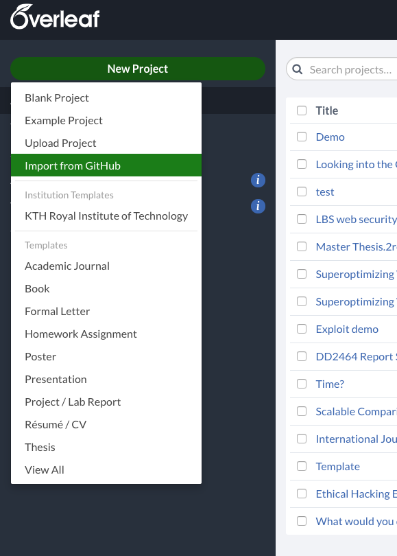
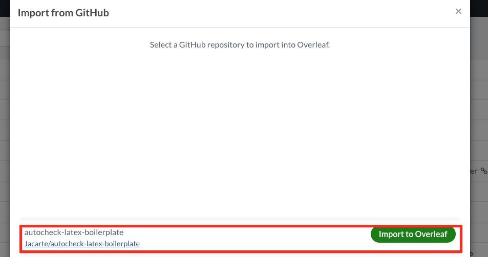
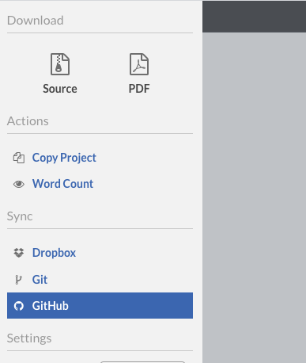
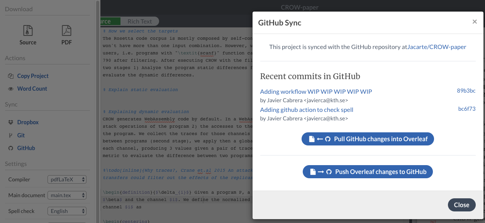
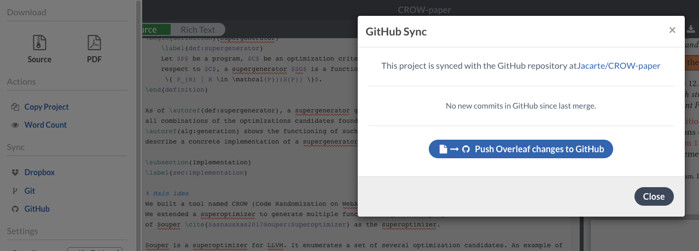
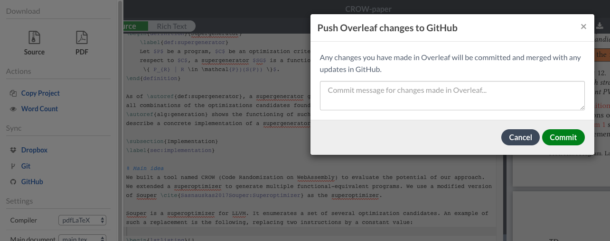

# autocheck-latex-boilerplate

[textidot](https://github.com/sylvainhalle/textidote) verifies spelling, grammar, style, and runs other sanity checks directly from a LaTeX file. This boilerplate repository executes textidot in the main.tex file in a GitHub Action, generating issues with the found warnings.


## Automatic issue reporting on GitHub


This repository contains an [action script](.github/workflows/spell_checking.yml) to perform spell check in the latex document. The detected errors are reported in a separated branch (`reports`) in [pdf](https://github.com/Jacarte/autocheck-latex-boilerplate/blob/reports/report.pdf) and [json](https://github.com/Jacarte/autocheck-latex-boilerplate/blob/reports/report.json) formats. Also a new issue is opened after every push with the itextdot report. Each warning listed in the issue is connected with the main.tex line, for [example](https://github.com/Jacarte/autocheck-latex-boilerplate/issues/2).

## Troubleshooting and TODOS
- The automated issue publication is hardcoded for now, this means that you need to specify the repo URL in the [python script file](https://github.com/Jacarte/autocheck-latex-boilerplate/blob/f952b4061c21d20b24ae62da93c9e86bf7dc3e8a/.github/parse_json2md.py#L26).


## Spell check with textidot

To manual execute the spell check, first download the textidot binary, then run the following command:

```java -jar textidot.jar --dict dico.txt --check en main.tex```


- Write words to be ommited in dico.txt, one by line

## Link repository to an overleaf document

1. Fork this repo
2. Import the GitHub repository in overleaf: 
    

    

### Sync overleaf with GitHub

- To pull changes from GitHub in overleaf: Click the overleaf icon in the top left and click on the GitHub icon, then pull:



- To push changes from overleaf: Click the overleaf icon in the top left and click on the GitHub icon, then push:

  - Write the commit message
  
